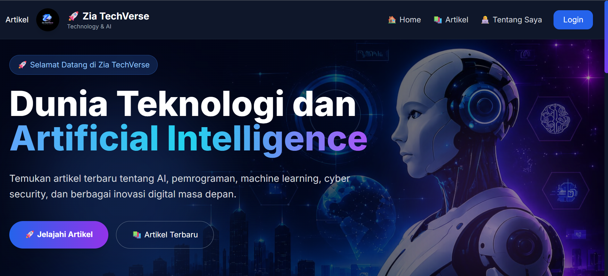

# 🚀 Zia TechVerse

## Exploring Technology and Artificial Intelligence



---

## 📖 Tentang Proyek

Zia TechVerse adalah website blog berbasis Laravel yang membahas perkembangan teknologi, kecerdasan buatan (Artificial Intelligence), dan inovasi digital.

Website ini dibuat sebagai proyek mata kuliah Pemrograman Web Program Studi Teknik Informatika Universitas Malikussaleh.

---

## ✨ Fitur Utama

- Login dan Register
- Dashboard Admin
- CRUD Artikel
- CRUD Kategori
- Upload Thumbnail
- Sistem Komentar
- Pencarian Artikel
- Filter Kategori
- Tampilan Responsif

---

## 🛠️ Teknologi yang Digunakan

- Laravel 12
- PHP 8.2
- MySQL
- Tailwind CSS
- Vite
- Laravel Breeze
- Git dan GitHub

---

## 📂 Struktur Proyek

```text
app/
bootstrap/
config/
database/
public/
resources/
routes/
storage/
```

---

## 👩‍💻 Pengembang

**Nurfauziah**

Mahasiswi Teknik Informatika

Universitas Malikussaleh

---

## 📄 Lisensi

Proyek ini dibuat untuk keperluan pembelajaran dan tugas akademik.