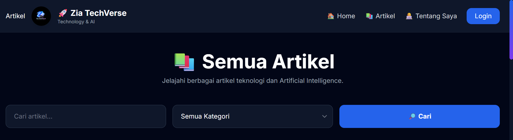
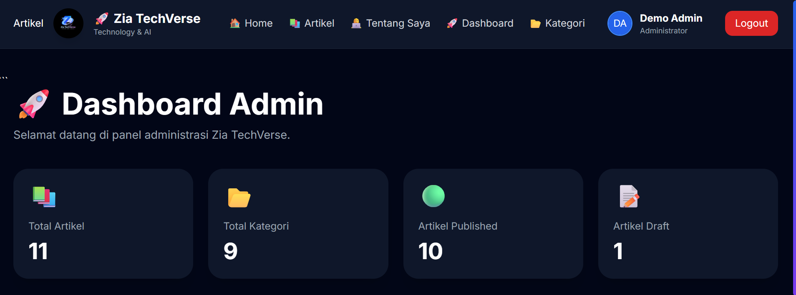

# 🚀 Zia TechVerse

## Exploring Technology and Artificial Intelligence

---

## 📖 Tentang Proyek

Zia TechVerse adalah website blog berbasis Laravel yang membahas teknologi, Artificial Intelligence (AI), dan inovasi digital.

Website ini dibuat sebagai proyek mata kuliah Pemrograman Web.

---

## ✨ Fitur Utama

- Login dan Register
- Dashboard Admin
- CRUD Artikel
- CRUD Kategori
- Upload Thumbnail
- Sistem Komentar
- Pencarian Artikel
- Filter Kategori
- Tampilan Responsif

---

## 🖼️ Tampilan Website

### Halaman Artikel

### Dashboard Admin

---

## 🛠️ Teknologi yang Digunakan

- Laravel 12
- PHP 8.2
- MySQL
- Tailwind CSS
- Vite
- Laravel Breeze
- Git dan GitHub

---

## 👩‍💻 Pengembang

**Nurfauziah**

Mahasiswi Teknik Informatika

Universitas Malikussaleh
## License

The Laravel framework is open-sourced software licensed under the [MIT license](https://opensource.org/licenses/MIT).
